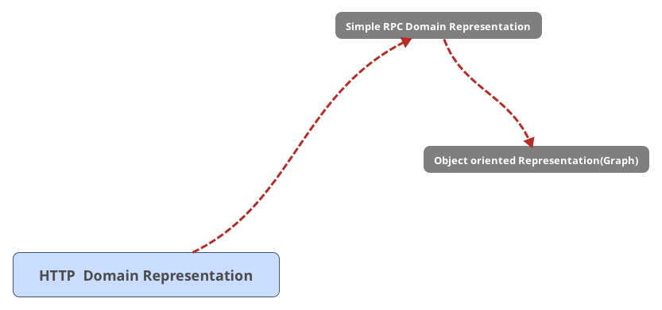

# Callable

Callable is an abstraction on top of RAML Domain model which aims to represent
http APIs in terms of modules, classes and methods.
 
Problem statement:

This repository aims to bridge HTTP domain model and classical Object oriented interfaces.

I need to build wizard which allows doing it!!!

What is the right design process:

  * Define Domain objects (classes)
  * Define operations 
  * Map classes to shapes
  
  
  
 ---
 
 How we are structuring the world? Homo Sapiense have a tool named `Classification`, we like to devide things
 into the classes of objects, having some properties and some semantic meaning from problem domain. This classes usually form hierarchy of the things (Taxonomy).
 
 So when we are starting to solve problem we are usually starting from splitting problem domain into classes 
 of the things which model problem domain. Lets name single units of this semantical classification - `Classes`
 
 However different situations require different views on this things, 
 lets name different views of the thing represented by one semantical class of the things - `Shapes`  
 
 In the software world and particulary in APIs, we have following patterns which are oftenly used to build shapes
  1. Omit some properties of the thing which are not relevant or should not be visible in the current context
  2. Transform some properties of the things to a different shapes
  3. Mix several properties of the thing into one 
  4. Take some property of the thing and use it to represent the thing as whole (usually it is ID or partial ID of the thing)
  
 One way to model shapes is to have different types describing different shapes of the thing. This option is most universal
 one but of course it has several drawbacks suchs as:
   * we are oftenly caused to duplicated information
   * we need to maintain information that this types are connected some how
   * It is not clear what and where is semantic class of the thing which actually describes a problem domain.
   
 This repository represent another approach to building shape. which seems to provide more clear way to define them 
 for a lot of stuations: The approach is:
 
 Lets name different semantical situations - scopes. Now lets annotate properties which are visible only in some contexts
 with the references to the scopes in which they are relevant. If the property requires different representation in
 some context, annotate this property with an annotation which defines the scope. It allows us to solve 1. and partially 2.
 
 Now lets add one more annotation which allows us to say that this scalar type is just a representation of some property of
 domain class. Lets name this anotation `reference`. It allows us to solve situation 4.
 
 We still have cases 2 and case 3 uncovered and it seeems that we actually need to create another type to represent it.
 Lets add annotation `ShapeOf` which allows us to mark that this type is just shape of a model class. This will solve 2 and 3 in
 the rare situations when it is actually needed.
 
 
  